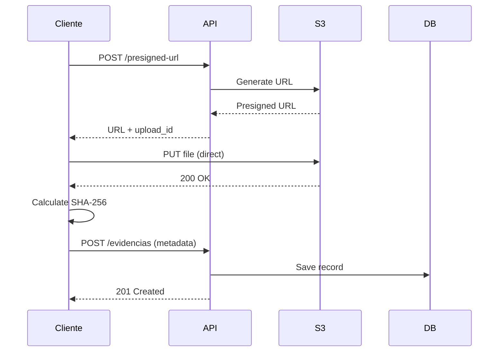

# M2 Campo API - Referência Completa

## 📋 Índice

- [Visão Geral](#visão-geral)
- [Autenticação](#autenticação)
- [Atividades](#atividades)
- [Evidências](#evidências)
- [Relatórios EVD01](#relatórios-evd01)
- [Códigos de Erro](#códigos-de-erro)
- [Exemplos Completos](#exemplos-completos)

---

## Visão Geral

**Base URL**: `http://localhost:8001/api`  
**Formato**: JSON  
**Autenticação**: OAuth2/OIDC (Keycloak)  
**Versão**: 1.0.0

### Endpoints Disponíveis

| Recurso | Endpoints | Métodos |
|---------|-----------|---------|
| **Atividades** | `/atividades` | GET, POST |
| | `/atividades/{id}` | GET, PATCH, DELETE |
| | `/atividades/stats/summary` | GET |
| **Evidências** | `/atividades/{id}/evidencias/presigned-url` | POST |
| | `/atividades/{id}/evidencias` | POST, GET |
| | `/evidencias/{id}` | DELETE |
| **Relatórios** | `/relatorios/evd01` | GET |
| | `/relatorios/download/{filename}` | GET |

---

## Autenticação

### OAuth2 / OIDC

```bash
# 1. Obter token (Keycloak)
TOKEN=$(curl -X POST "http://localhost:8080/realms/techdengue/protocol/openid-connect/token" \
  -H "Content-Type: application/x-www-form-urlencoded" \
  -d "grant_type=password" \
  -d "client_id=techdengue-api" \
  -d "client_secret=nLAgeUX8fEEvsif0ooNANo38NDnTzcqs" \
  -d "username=agente_campo" \
  -d "password=senha123" \
  | jq -r '.access_token')

# 2. Usar token nas requisições
curl -H "Authorization: Bearer $TOKEN" \
  "http://localhost:8001/api/atividades"
```

### Papéis (Roles)

- **CAMPO**: Agente de campo (CRUD próprias atividades)
- **GESTOR**: Gestor local (view todas, edit limitado)
- **VIGILANCIA**: Vigilância epidemiológica (view todas)
- **ADMIN**: Administrador (acesso total)

---

## Atividades

### POST /atividades
Criar nova atividade de campo.

**Request:**
```json
{
  "tipo": "VISTORIA",
  "municipio_cod_ibge": "5103403",
  "localizacao": {
    "type": "Point",
    "coordinates": [-56.0967, -15.6014, 150]
  },
  "descricao": "Vistoria domiciliar setor A1",
  "metadata": {
    "setor": "A1",
    "quadra": "12",
    "imovel_numero": "456"
  }
}
```

**Response:** `201 Created`
```json
{
  "id": 123,
  "tipo": "VISTORIA",
  "status": "CRIADA",
  "origem": "MANUAL",
  "municipio_cod_ibge": "5103403",
  "localizacao": {
    "type": "Point",
    "coordinates": [-56.0967, -15.6014, 150]
  },
  "descricao": "Vistoria domiciliar setor A1",
  "metadata": {"setor": "A1", "quadra": "12", "imovel_numero": "456"},
  "criado_em": "2024-01-15T14:30:00Z",
  "atualizado_em": "2024-01-15T14:30:00Z",
  "iniciado_em": null,
  "encerrado_em": null
}
```

**Tipos de Atividade:**
- `VISTORIA` - Vistoria domiciliar
- `LIRAA` - Levantamento de Índice Rápido
- `NEBULIZACAO` - Nebulização/fumacê
- `ARMADILHA` - Armadilhas para mosquitos
- `PESQUISA_LARVARIA` - Pesquisa larvária
- `EDUCACAO` - Educação em saúde
- `BLOQUEIO` - Bloqueio de transmissão
- `OUTROS` - Outros tipos

---

### GET /atividades
Listar atividades com filtros e paginação.

**Query Parameters:**
- `status` (array): Filtrar por status
- `tipo` (array): Filtrar por tipo
- `municipio` (string): Código IBGE (7 dígitos)
- `page` (int): Número da página (default: 1)
- `page_size` (int): Itens por página (default: 50, max: 100)

**Exemplo:**
```bash
curl "http://localhost:8001/api/atividades?status=EM_ANDAMENTO&page=1&page_size=20"
```

**Response:** `200 OK`
```json
{
  "items": [
    {
      "id": 123,
      "tipo": "VISTORIA",
      "status": "EM_ANDAMENTO",
      ...
    }
  ],
  "total": 150,
  "page": 1,
  "page_size": 20
}
```

---

### GET /atividades/{id}
Obter detalhes de uma atividade.

**Response:** `200 OK` (mesma estrutura do POST)

---

### PATCH /atividades/{id}
Atualizar atividade.

**Request:**
```json
{
  "status": "EM_ANDAMENTO",
  "descricao": "Vistoria em progresso - 5 imóveis visitados"
}
```

**Transições de Status Válidas:**
- `CRIADA` → `EM_ANDAMENTO` (auto-set `iniciado_em`)
- `EM_ANDAMENTO` → `CONCLUIDA` (auto-set `encerrado_em`)
- `EM_ANDAMENTO` → `CANCELADA`
- `Qualquer` → `CANCELADA` (apenas GESTOR/ADMIN)

**Response:** `200 OK`

---

### DELETE /atividades/{id}
Cancelar atividade (soft delete).

**Response:** `204 No Content`

---

### GET /atividades/stats/summary
Obter estatísticas agregadas.

**Query Parameters:**
- `municipio` (optional): Filtrar por município

**Response:** `200 OK`
```json
{
  "total": 1543,
  "por_status": {
    "CRIADA": 234,
    "EM_ANDAMENTO": 156,
    "CONCLUIDA": 1098,
    "CANCELADA": 55
  },
  "por_tipo": {
    "VISTORIA": 890,
    "LIRAA": 320,
    "NEBULIZACAO": 180
  },
  "por_municipio": {
    "5103403": 450,
    "5103502": 320
  }
}
```

---

## Evidências

### Fluxo de Upload Completo



### POST /atividades/{id}/evidencias/presigned-url
Gerar URL para upload direto ao S3.

**Request:**
```json
{
  "filename": "foto_fachada.jpg",
  "content_type": "image/jpeg",
  "tamanho_bytes": 2048576
}
```

**Response:** `200 OK`
```json
{
  "upload_url": "http://minio:9000/techdengue-evidencias/atividades/123/uuid_foto.jpg?X-Amz-...",
  "upload_id": "550e8400-e29b-41d4-a716-446655440000",
  "expires_in": 300,
  "fields": {
    "key": "atividades/123/uuid_foto.jpg"
  }
}
```

**Content-Types Válidos:**
- `image/jpeg`, `image/png`, `image/webp`
- `video/mp4`, `video/quicktime`
- `application/pdf`
- `audio/mpeg`, `audio/wav`

**Limites:**
- Tamanho máximo: 50MB
- Validade URL: 5 minutos

---

### POST /atividades/{id}/evidencias
Registrar evidência após upload.

**Request:**
```json
{
  "atividade_id": 123,
  "tipo": "FOTO",
  "upload_id": "550e8400-e29b-41d4-a716-446655440000",
  "hash_sha256": "abc123def456...",
  "tamanho_bytes": 2048576,
  "url_s3": "atividades/123/uuid_foto.jpg",
  "descricao": "Fachada do imóvel",
  "metadata": {
    "exif": {
      "make": "Apple",
      "model": "iPhone 13",
      "datetime_original": "2024-01-15T14:30:00",
      "gps_latitude": -15.6014,
      "gps_longitude": -56.0967,
      "gps_altitude": 150.5
    }
  }
}
```

**Response:** `201 Created`
```json
{
  "id": 456,
  "atividade_id": 123,
  "tipo": "FOTO",
  "status": "CONCLUIDA",
  "hash_sha256": "abc123def456...",
  "tamanho_bytes": 2048576,
  "url_s3": "atividades/123/uuid_foto.jpg",
  "url_download": "http://minio:9000/...?X-Amz-Expires=3600...",
  "descricao": "Fachada do imóvel",
  "metadata": {...},
  "criado_em": "2024-01-15T14:31:00Z",
  "atualizado_em": "2024-01-15T14:31:00Z"
}
```

---

### GET /atividades/{id}/evidencias
Listar evidências de uma atividade.

**Query Parameters:**
- `tipo` (array): Filtrar por tipo (FOTO, VIDEO, DOCUMENTO, AUDIO)

**Response:** `200 OK`
```json
{
  "items": [
    {
      "id": 456,
      "tipo": "FOTO",
      "url_download": "http://...",
      ...
    }
  ],
  "total": 5
}
```

---

### DELETE /evidencias/{id}
Remover evidência (soft delete).

**Response:** `204 No Content`

---

## Relatórios EVD01

### GET /relatorios/evd01
Gerar relatório de evidências em PDF/A-1.

**Query Parameters:**
- `atividade_id` (required): ID da atividade
- `tamanho_pagina`: `A4` (default) ou `A1`
- `orientacao`: `portrait` (default) ou `landscape`
- `formato`: `pdf` (default) ou `json`
- `incluir_miniaturas`: true/false
- `incluir_qrcode`: true/false

**Exemplo:**
```bash
curl "http://localhost:8001/api/relatorios/evd01?atividade_id=123&tamanho_pagina=A1&orientacao=landscape"
```

**Response:** `200 OK`
```json
{
  "metadata": {
    "atividade_id": 123,
    "atividade_tipo": "VISTORIA",
    "municipio_cod_ibge": "5103403",
    "dt_geracao": "2024-01-15T14:30:00Z",
    "total_evidencias": 5,
    "merkle_root_hash": "abc123def456...",
    "formato": "pdf",
    "tamanho_pagina": "A1",
    "orientacao": "landscape"
  },
  "arquivo": "EVD01_Atividade_123_20240115_143000.pdf",
  "tamanho_bytes": 524288,
  "url_download": "/relatorios/download/EVD01_Atividade_123_20240115_143000.pdf",
  "merkle_tree": {
    "root_hash": "abc123def456...",
    "leaf_count": 5,
    "tree_depth": 3,
    "leaves": [
      {
        "evidencia_id": 456,
        "hash_sha256": "def456..."
      }
    ]
  }
}
```

### Merkle Tree

O relatório inclui uma árvore Merkle para verificação de integridade:

```
         ROOT
        /    \
      H12    H34
     /  \   /  \
    H1  H2 H3  H4
    |   |  |   |
   E1  E2 E3  E4
```

- **Root Hash**: Representa todo o conjunto
- **Leaf Hashes**: Hash SHA-256 de cada evidência
- **Verificação**: Qualquer alteração invalida o root hash

---

### GET /relatorios/download/{filename}
Download de relatório gerado.

**Response:** `200 OK` (arquivo PDF)

**Segurança:**
- Path traversal protection
- Apenas arquivos EVD01_*

---

## Códigos de Erro

| Código | Descrição | Exemplo |
|--------|-----------|---------|
| **200** | OK | Requisição bem-sucedida |
| **201** | Created | Recurso criado |
| **204** | No Content | Deletado com sucesso |
| **400** | Bad Request | Parâmetros inválidos |
| **401** | Unauthorized | Token ausente/inválido |
| **403** | Forbidden | Sem permissão |
| **404** | Not Found | Recurso não encontrado |
| **422** | Unprocessable Entity | Validação Pydantic falhou |
| **500** | Internal Server Error | Erro no servidor |

**Formato de Erro:**
```json
{
  "detail": "Descrição do erro"
}
```

---

## Exemplos Completos

### 1. Criar Atividade e Upload de Foto

```bash
#!/bin/bash

# 1. Criar atividade
ATIV=$(curl -X POST "http://localhost:8001/api/atividades" \
  -H "Content-Type: application/json" \
  -d '{
    "tipo": "VISTORIA",
    "municipio_cod_ibge": "5103403",
    "descricao": "Vistoria completa"
  }')

ATIV_ID=$(echo $ATIV | jq -r '.id')
echo "Atividade criada: $ATIV_ID"

# 2. Solicitar presigned URL
PRESIGNED=$(curl -X POST "http://localhost:8001/api/atividades/$ATIV_ID/evidencias/presigned-url" \
  -H "Content-Type: application/json" \
  -d '{
    "filename": "fachada.jpg",
    "content_type": "image/jpeg",
    "tamanho_bytes": 1048576
  }')

UPLOAD_URL=$(echo $PRESIGNED | jq -r '.upload_url')
UPLOAD_ID=$(echo $PRESIGNED | jq -r '.upload_id')
OBJECT_KEY=$(echo $PRESIGNED | jq -r '.fields.key')

# 3. Upload direto ao S3
curl -X PUT "$UPLOAD_URL" \
  -H "Content-Type: image/jpeg" \
  --upload-file fachada.jpg

# 4. Calcular hash
HASH=$(sha256sum fachada.jpg | awk '{print $1}')

# 5. Registrar evidência
curl -X POST "http://localhost:8001/api/atividades/$ATIV_ID/evidencias" \
  -H "Content-Type: application/json" \
  -d "{
    \"atividade_id\": $ATIV_ID,
    \"tipo\": \"FOTO\",
    \"upload_id\": \"$UPLOAD_ID\",
    \"hash_sha256\": \"$HASH\",
    \"tamanho_bytes\": 1048576,
    \"url_s3\": \"$OBJECT_KEY\",
    \"descricao\": \"Fachada do imóvel\"
  }"

# 6. Gerar relatório EVD01
curl "http://localhost:8001/api/relatorios/evd01?atividade_id=$ATIV_ID" \
  | jq -r '.url_download' \
  | xargs -I {} curl "http://localhost:8001/api{}" -O

echo "Relatório gerado!"
```

### 2. Workflow Completo de Campo

```bash
# Criar atividade → Iniciar → Adicionar 3 fotos → Concluir → Relatório

# 1. Criar
ATIV_ID=$(curl -X POST ... | jq -r '.id')

# 2. Iniciar
curl -X PATCH "http://localhost:8001/api/atividades/$ATIV_ID" \
  -H "Content-Type: application/json" \
  -d '{"status": "EM_ANDAMENTO"}'

# 3. Upload 3 fotos
for i in {1..3}; do
  # Presigned URL → Upload → Register
  # ...
done

# 4. Concluir
curl -X PATCH "http://localhost:8001/api/atividades/$ATIV_ID" \
  -d '{"status": "CONCLUIDA"}'

# 5. Relatório A4
curl "http://localhost:8001/api/relatorios/evd01?atividade_id=$ATIV_ID"
```

---

## Performance e Limites

| Recurso | Limite |
|---------|--------|
| **Upload File Size** | 50 MB |
| **Presigned URL Validity** | 5 minutes |
| **Download URL Validity** | 1 hour |
| **Max Evidências/Atividade** | 100 |
| **Max Atividades/Page** | 100 |
| **Request Timeout** | 30s |
| **Rate Limiting** | 100 req/min |

---

## Suporte

- **Documentação**: `/docs` (Swagger UI)
- **OpenAPI Spec**: `/openapi.json`
- **Health Check**: `/api/health`
- **Metrics**: `/metrics` (Prometheus)
